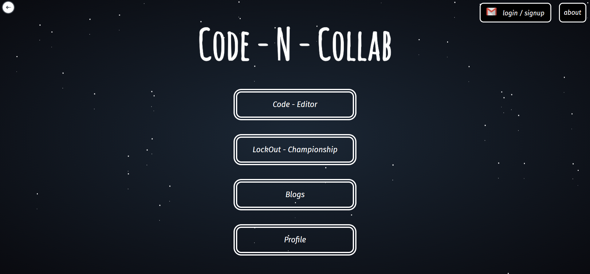
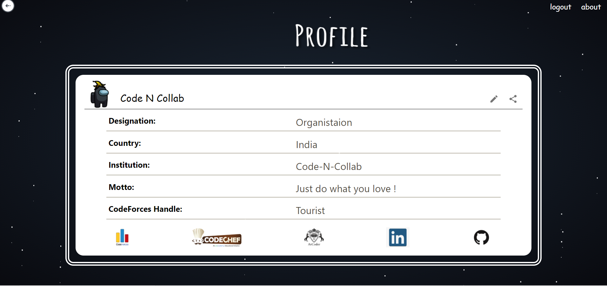
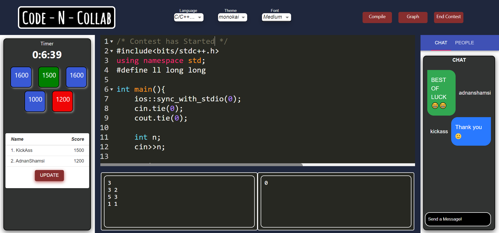

<p align="center">


</p>
<br/>

[![Contributors][contributors-shield]][contributors-url]
[![Forks][forks-shield]][forks-url]
[![Stargazers][stars-shield]][stars-url]
[![MIT License][license-shield]][license-url]
[![Issues][issues-shield]][issues-url]
[![LinkedIn][linkedin-shield]][linkedin-url]
[](https://app.netlify.com/sites/code-n-collab/deploys)

<details open="open">
  <summary>Table of Contents</summary>
  <ol>
    <li>
      <a href="#-about">About</a>
      <ul>
        <li><a href="#-features">Features</a></li>
      </ul>
    </li>
    <li>
      <a href="#-getting-started">Getting Started</a>
      <ul>
        <li><a href="#prerequisites">Prerequisites</a></li>
      </ul>
         <ul>
        <li><a href="#installation">Installation</a></li>
      </ul>
    </li>
    <li><a href="#-contribution-guidelines">Contributing</a></li>
    <li><a href="#-contact">Contact</a></li>
    <li><a href="#-resources">Resources</a></li>
    <li><a href="#license">License</a></li>
  </ol>
</details>

<a href="https://code-n-collab.netlify.app/" target="_blank"  rel="noreferrer">
<table >
   <tr>
     <td>
        
     </td>
     <td >
       
     </td>
   </tr>
   <tr>
     <td>
       
     </td>
     <td>
       
     </td>
   </tr>
</table>
 </a>

# 🔖 About
Code - N - Collab is a Collaboration website for Software developers , Competitive coders , and every one who loves to code and collaborate with others to learn and grow. It provides users to collaborate with their team , friends and also find people with similar their interests.

## 🚀 Features
It provides users with :-
- Real-time code editor :
  to share your code and discuss about it with your collegues or solves a competitive coding problem and discuss it , you can also fetch CP problems from popular websites such as codeforces , codechef , atcoder , Cses , geeksforgeeks , etc. It also has a chat section for people to talk about the problem

- Lockout Championship :
  for people who are looking to compete on codeforces problemset , they can set their codeforces handle in profile section and enjoy competing with their friends and challenging on interesting problems which will be filter on user's choice and then randomly selects 5 problems in a problem rating range , To challenge your friend you just need to share your Url before starting the contest

- Blogs :
  People can share their knowledge , learn and ask any thing in our blogs section

## 🔥 Getting Started

### Prerequisites

- <a href="https://reactjs.org/">Reactjs</a>
- <a href="https://nodejs.org/en/">Nodejs</a>

#### Setup Environment variables
```
     REACT_APP_SIGNALLING_URL1 = wss://y-webrtc-signaling-eu.herokuapp.com
     REACT_APP_SIGNALLING_URL2 = wss://y-webrtc-signaling-us.herokuapp.com
     REACT_APP_BASE_URL = 'http://localhost:8080/'
```

#### Setup backend for Code - N - Collab
<a href="https://github.com/atharmohammad/Code-N-Collab-Server">Code - N - Collab Backend</a>

### Installation

- Fork the Repository

```
   $ git clone https://github.com/<your-username>/Code-N-Collab.git
   $ cd Code-N-Collab
   $ git remote add upstream https://github.com/atharmohammad/Code-N-Collab.git
   $ npm install
   $ npm start
```

## 💁 Contribution guidelines

 we encourage organizations and individuals to contribute requirements, documentation, issues, new templates, and code.
 For code contributions, read :

- The <a href="CODE_OF_CONDUCT.md" >Code of Conduct</a>
- The <a href="CONTRIBUTING.md">Contribution Guidelines</a>
- The <a href="https://drive.google.com/drive/folders/1SB2dGPe3Avzsj0VXJ3sclTTdpjC1FbpV?usp=sharing">Documentation</a>

## 📲 Contact

<a href="https://www.linkedin.com/in/athar-mohammad-34068a157/">Mohd Athar</a> - mohd.rule123@gmail.com
<br>
<a href="https://www.linkedin.com/in/adnan-shamsi-5830301b3/">Adnan Shamsi</a> - adnanshamsi023@gmail.com

## 📚 Resources
- <a href="https://socket.io/docs/v4" >Socket.Io Documentation </a>
- <a href="https://github.com/yjs/yjs/blob/master/README.md" > Yjs Docs </a>
- <a href="https://github.com/scniro/react-codemirror2">React-Codemirror Editor Docs</a>

## License
<a href="LICENSE">Apache License 2.0</a>

[contributors-shield]: https://img.shields.io/github/contributors/atharmohammad/Code-N-Collab.svg?style=for-the-badge
[contributors-url]: https://github.com/atharmohammad/Code-N-Collab/graphs/contributors
[forks-shield]: https://img.shields.io/github/forks/atharmohammad/Code-N-Collab.svg?style=for-the-badge
[forks-url]: https://github.com/atharmohammad/Code-N-Collab/network/members
[stars-shield]: https://img.shields.io/github/stars/atharmohammad/Code-N-Collab.svg?style=for-the-badge
[stars-url]: https://github.com/atharmohammad/Code-N-Collab/stargazers
[issues-shield]: https://img.shields.io/github/issues/atharmohammad/Code-N-Collab.svg?style=for-the-badge
[issues-url]: https://github.com/atharmohammad/Code-N-Collab/issues
[license-shield]: https://img.shields.io/github/license/atharmohammad/Code-N-Collab.svg?style=for-the-badge
[license-url]: https://github.com/atharmohammad/Code-N-Collab/blob/master/LICENSE
[linkedin-shield]: https://img.shields.io/badge/-LinkedIn-black.svg?style=for-the-badge&logo=linkedin&colorB=555
[linkedin-url]: https://www.linkedin.com/in/athar-mohammad-34068a157/
[product-screenshot]: Images/homepage.PNG
